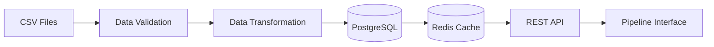
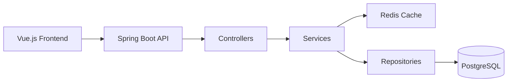
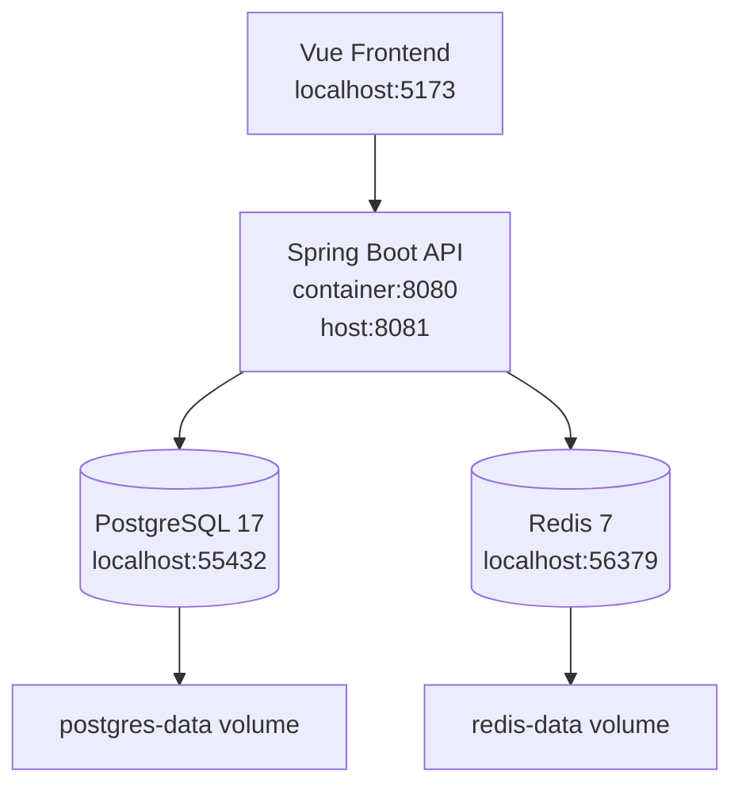
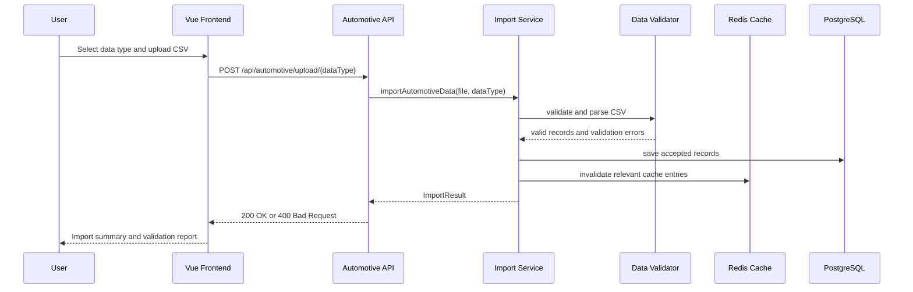

# Automotive ETL Data Platform

A containerized ETL platform that ingests CSV automotive data, validates it, applies transformations, stores it in PostgreSQL, and serves it via a cached API.

The platform implements a complete Extract-Transform-Load pipeline with robust data quality controls, real-time statistics, and production-grade reliability for automotive industry data workflows.

## Table of Contents

- [Overview](#overview)
- [Features](#features)
- [ETL Pipeline](#etl-pipeline)
- [Architecture](#architecture)
- [Production Considerations](#production-considerations)
- [Tech Stack](#tech-stack)
- [Project Structure](#project-structure)
- [Getting Started](#getting-started)
- [API Reference](#api-reference)
- [Configuration](#configuration)
- [Testing](#testing)
- [Development](#development)
- [Roadmap](#roadmap)

## Overview

The Automotive ETL Data Platform is a production-grade data integration system designed specifically for automotive industry data workflows. It provides a complete Extract-Transform-Load solution for:

- **Data Ingestion**: Multi-domain CSV import with robust error handling and validation
- **Data Transformation**: Field normalization, derived calculations, and data enrichment
- **Data Quality**: Row-level validation with detailed error reporting and partial success handling
- **Reliable Storage**: PostgreSQL with proper indexing and data integrity
- **Real-time Serving**: Redis-powered caching for high-performance data access
- **Pipeline Interface**: Vue.js frontend for monitoring and interacting with the ETL pipeline

The platform is built with production-grade patterns including validation-first ingestion, cache invalidation strategies, idempotent operations, and scalable containerized deployment.

## Features

### Core Data System Functionality

- **Multi-format CSV Ingestion**: Support for different automotive data schemas with validation
- **Row-level Validation**: Detailed validation with specific error messages and partial success handling
- **Data Transformation**: Field normalization and derived field calculations
- **Real-time Statistics**: Cached statistics for high-performance data access
- **Data Management APIs**: CRUD operations for all data types with proper error handling
- **Health Monitoring**: Application and database health checks for system reliability

### Data Domains Supported

- **Vehicles**: VIN, make, model, year, status tracking
- **Dealers**: Dealer information, status, and geographic data
- **Warranties**: Warranty coverage, status, and type management
- **Fleets**: Fleet management with status and location tracking
- **Service Records**: Maintenance history with status and type classification

### Data System Features

- **Redis Caching**: 5-minute cache for statistics and query results with automatic invalidation
- **PostgreSQL Storage**: Durable relational database with proper indexing and data integrity
- **Docker Deployment**: Complete containerized infrastructure for scalable deployment
- **API Documentation**: RESTful endpoints with proper HTTP semantics
- **Error Handling**: Comprehensive validation and error reporting for data quality assurance

## ETL Pipeline

The platform implements a complete Extract-Transform-Load pipeline for automotive data:

### Extract → CSV Upload

The extraction stage reads and parses CSV files from user uploads, converting raw data into structured format for processing.

- Multi-format CSV ingestion with schema validation
- Support for vehicles, dealers, warranties, fleets, and service records
- File parsing with error recovery and detailed reporting

### Validate → Row-level Checks

The validation stage ensures data quality by applying business rules, constraints, and format checks to each record before processing.

- **Field-level validation** with business rules and constraints
- **Data type validation** and format checking for data quality
- **Referential integrity validation** across related data domains
- **Partial success handling** with detailed error reporting - process valid records while flagging issues
- **Duplicate detection** and handling with configurable policies
- **Comprehensive error reporting** with specific field-level error messages
- **Validation statistics** showing success/failure rates for data quality monitoring

### Transform → Normalization & Derived Fields

The transformation stage normalizes data formats, calculates derived fields, and applies business logic to prepare data for storage.

- Field normalization (case, whitespace, format standardization)
- Derived field calculations (vehicle age, warranty duration)
- Status mapping and enum normalization
- Geographic data standardization
- Business logic transformations

### Load → PostgreSQL

The load stage persists validated and transformed data into PostgreSQL with transaction safety and data integrity constraints.

- Batch loading with transaction safety
- Proper indexing and constraint enforcement
- Data integrity checks
- Audit trail and metadata storage

### Serve → API + Redis

The serve stage provides high-performance data access through RESTful APIs backed by Redis caching for optimal response times.

- RESTful API for data access and management
- Redis caching for high-performance queries
- Real-time statistics and analytics
- Cache invalidation on data updates
- Health monitoring and metrics

### Pipeline Flow Diagram



### Vehicle Data

```csv
vin,make,model,year,status
1HGCM82633A123456,Honda,Accord,2020,ACTIVE
2T1BURHE1GC123456,Toyota,Camry,2016,USED
```

### Dealer Data

```csv
dealerCode,name,email,phone,status,city,state
D001,Honda Dealer,dealer@honda.com,555-0100,ACTIVE,Los Angeles,CA
D002,Toyota Dealer,info@toyota.com,555-0200,ACTIVE,San Francisco,CA
```

### Warranty Data

```csv
warrantyNumber,vin,coverageType,status,startDate,endDate
W123456,1HGCM82633A123456,COMPREHENSIVE,ACTIVE,2020-01-01,2025-01-01
W789012,2T1BURHE1GC123456,POWERTRAIN,EXPIRED,2016-01-01,2021-01-01
```

### Fleet Data

```csv
fleetId,name,company,status,city,state
F001,Corporate Fleet,ABC Corp,ACTIVE,Los Angeles,CA
F002,Rental Fleet,Rental Inc,MAINTENANCE,San Diego,CA
```

### Service Records

```csv
serviceId,vin,serviceType,status,serviceDate,odometer
S123456,1HGCM82633A123456,OIL_CHANGE,COMPLETED,2024-01-15,45000
S789012,2T1BURHE1GC123456,BRAKE_SERVICE,SCHEDULED,2024-02-01,75000
```

## Architecture

### Application Flow



### Local Infrastructure



### Data Import Sequence



## Production Considerations

The platform is designed with production-grade engineering practices:

### Validation-First Ingestion

- All data undergoes comprehensive validation before storage
- Partial success handling allows processing valid records while reporting errors
- Detailed error reporting enables data quality monitoring
- Business rule validation ensures data integrity

### Cache Invalidation Strategy

- Automatic cache invalidation on data updates
- Namespace-based cache keys for targeted invalidation
- 5-minute TTL balances performance with data freshness
- Manual cache clearing for maintenance scenarios

### Idempotency and Data Quality

- Duplicate detection during import processes
- Transaction-safe batch loading operations
- Proper constraint enforcement at database level
- Audit trail for data lineage and troubleshooting

### Separation of Concerns

- Clear boundaries between validation, transformation, and storage
- Service layer encapsulates business logic
- Repository pattern for data access abstraction
- Configuration externalization for different environments

### Scalability Design

- Stateless application services enable horizontal scaling
- Containerized deployment with Docker Compose
- Redis caching reduces database load
- Proper indexing for query performance
- Connection pooling for database efficiency

### Monitoring and Reliability

- Health check endpoints for system monitoring
- Comprehensive error handling and logging
- Graceful degradation on service failures
- Database connection resilience

## Tech Stack

| Area                     | Technology                                  |
| ------------------------ | ------------------------------------------- |
| Frontend                 | Vue 3, Vite, Tailwind CSS, Lucide Icons     |
| Frontend package manager | Bun                                         |
| Language                 | Java 17                                     |
| Framework                | Spring Boot 3.5                             |
| API                      | Spring Web, Spring Data REST                |
| Persistence              | Spring Data JPA, Hibernate                  |
| Database                 | PostgreSQL 17                               |
| Cache                    | Redis 7 with Spring Data Redis              |
| Build tool               | Maven                                       |
| Containerization         | Docker, Docker Compose                      |
| Testing                  | JUnit 5, Spring Boot Test, AssertJ, Mockito |

## Project Structure

```text
.
|-- Dockerfile                 # Spring Boot application container
|-- .dockerignore             # Docker ignore patterns
|-- docker-compose.yml        # Local development infrastructure
|-- frontend/                 # Vue.js frontend application
|   |-- Dockerfile           # Frontend container build
|   |-- src/                 # Vue components and styles
|   |-- package.json         # Frontend dependencies
|   `-- bun.lock            # Bun package manager lock file
|-- pom.xml                  # Maven build configuration
|-- samples/                  # Sample CSV files for testing
|   |-- automotive-contacts.csv
|   |-- dealers.csv
|   `-- vehicles.csv
|-- src/                     # Java backend source code
|   |-- main/
|   |   |-- java/com/platform/
|   |   |   |-- config/      # Spring configuration beans
|   |   |   |-- controller/  # REST API endpoints
|   |   |   |-- dto/         # Data transfer objects
|   |   |   |-- model/       # JPA entity classes
|   |   |   |-- repository/  # Spring Data repositories
|   |   |   |-- service/     # Business logic services
|   |   |   `-- DataPlatformApplication.java
|   |   `-- resources/
|   |       `-- application.yaml  # Application configuration
|   `-- test/                # Unit and integration tests
|       `-- java/com/platform/
`-- NOTES.md                # Development notes and TODOs
```

## Getting Started

### Prerequisites

- Docker Desktop or Docker Engine
- Git

### Quick Start

From a fresh clone, start the complete platform with one command:

```bash
docker compose up --build
```

This builds and starts all services:

- Spring Boot backend (port 8081)
- Vue.js frontend (port 5173)
- PostgreSQL database (port 55432)
- Redis cache (port 56379)

### Access Points

Once running, access the application at:

- **Frontend Application**: <http://localhost:5173>
- **Backend API**: <http://localhost:8081>
- **Database**: localhost:55432
- **Redis**: localhost:56379

### Health Check

Verify the application is running:

```bash
curl http://localhost:8081/health
```

Expected response: `OK`

### Local Development

For development, you can run services individually:

1. Start only the infrastructure:

```bash
docker compose up -d postgres redis
```

2. Run the backend locally:

```bash
./mvnw spring-boot:run
```

3. Run the frontend locally:

```bash
cd frontend
bun install
bun run dev
```

## API Reference

### Health Endpoints

#### Application Health

```http
GET /health
```

Returns `OK` if the application is healthy.

### Automotive Data Management

#### Upload Automotive Data

```http
POST /api/automotive/upload/{dataType}
```

Path Parameters:

- `dataType`: One of `VEHICLE`, `DEALER`, `WARRANTY`, `FLEET`, `SERVICE_RECORD`

Form Data:

- `file`: CSV file with appropriate schema

#### Get Supported Data Types

```http
GET /api/automotive/data-types
```

Returns list of supported data types with their schemas.

#### Get Statistics

```http
GET /api/automotive/statistics
```

Returns cached statistics for all data domains.

#### Get Domain-Specific Statistics

```http
GET /api/automotive/statistics/{domain}
```

Path Parameters:

- `domain`: `vehicles`, `dealers`, `warranties`, `fleets`, `services`

#### Clear Cache

```http
DELETE /api/automotive/cache
```

Clears all cached statistics.

### Legacy Endpoints

#### Generic Upload

```http
POST /api/upload
```

Legacy endpoint for generic record uploads.

#### Records Management

```http
GET /api/records
POST /api/records
PUT /api/records/{id}
DELETE /api/records/{id}
```

Basic CRUD operations for records.

## Configuration

### Environment Variables

| Variable               | Default                                          | Description               |
| ---------------------- | ------------------------------------------------ | ------------------------- |
| `SERVER_PORT`          | `8080`                                           | Spring Boot server port   |
| `DATABASE_URL`         | `jdbc:postgresql://localhost:55432/dataplatform` | PostgreSQL JDBC URL       |
| `DATABASE_USERNAME`    | `postgres`                                       | Database username         |
| `DATABASE_PASSWORD`    | `postgres`                                       | Database password         |
| `REDIS_HOST`           | `localhost`                                      | Redis host                |
| `REDIS_PORT`           | `56379`                                          | Redis port                |
| `JPA_DDL_AUTO`         | `update`                                         | Hibernate schema handling |
| `JPA_SHOW_SQL`         | `true`                                           | SQL logging               |
| `HIBERNATE_FORMAT_SQL` | `true`                                           | Pretty SQL logging        |

### Cache Configuration

- **Cache Duration**: 5 minutes for all statistics
- **Cache Key Prefix**: `stats:`
- **Cache Invalidation**: Automatic on data updates

## Testing

### Run Test Suite

```bash
./mvnw test
```

### Test Coverage

Current tests cover:

- Spring application context startup
- Automotive data import workflows
- CSV validation and error handling
- Statistics service functionality
- Repository layer operations

### Frontend Testing

```bash
cd frontend
bun run build
```

## Development

### Code Organization

- **Controllers**: Handle HTTP requests and responses
- **Services**: Business logic and orchestration
- **Repositories**: Data access layer
- **Models**: Entity definitions and data types
- **DTOs**: Data transfer objects for API responses
- **Config**: Application configuration and beans

### Adding New Data Types

1. Add new enum value to `DataType.java`
2. Create entity class in `model/` package
3. Create repository interface in `repository/` package
4. Update `AutomotiveImportService` for validation
5. Add statistics methods to `StatisticsService`

### Database Schema

The application uses JPA/Hibernate for automatic schema generation. Tables are created based on entity classes with proper relationships and indexes.

## Roadmap

### Near Term

- [ ] Enhanced data validation rules
- [ ] Bulk import optimization
- [ ] Export functionality for all data types
- [ ] Advanced filtering and search
- [x] Basic data transformation pipeline (field normalization, derived calculations)

### Medium Term

- [ ] Real-time WebSocket updates
- [ ] Advanced analytics dashboard
- [ ] Data lineage tracking
- [ ] Integration with external automotive APIs
- [ ] Multi-tenant support

### Long Term

- [ ] Machine learning for predictive analytics
- [ ] Cloud deployment (AWS/Azure)
- [ ] Microservices architecture
- [ ] GraphQL API
- [ ] Mobile application

### Current Limitations

- Single CSV file upload at a time
- Basic transformation capabilities (field normalization, derived calculations)
- Limited reporting functionality
- No user authentication/authorization
- No audit logging

---

## License

This project is licensed under the MIT License - see the LICENSE file for details.

## Contributing

1. Fork the repository
2. Create a feature branch
3. Make your changes
4. Add tests for new functionality
5. Submit a pull request

## Support

For questions and support, please open an issue in the GitHub repository.
