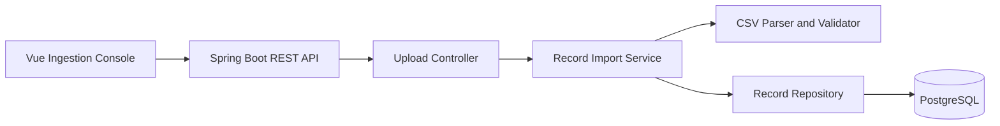
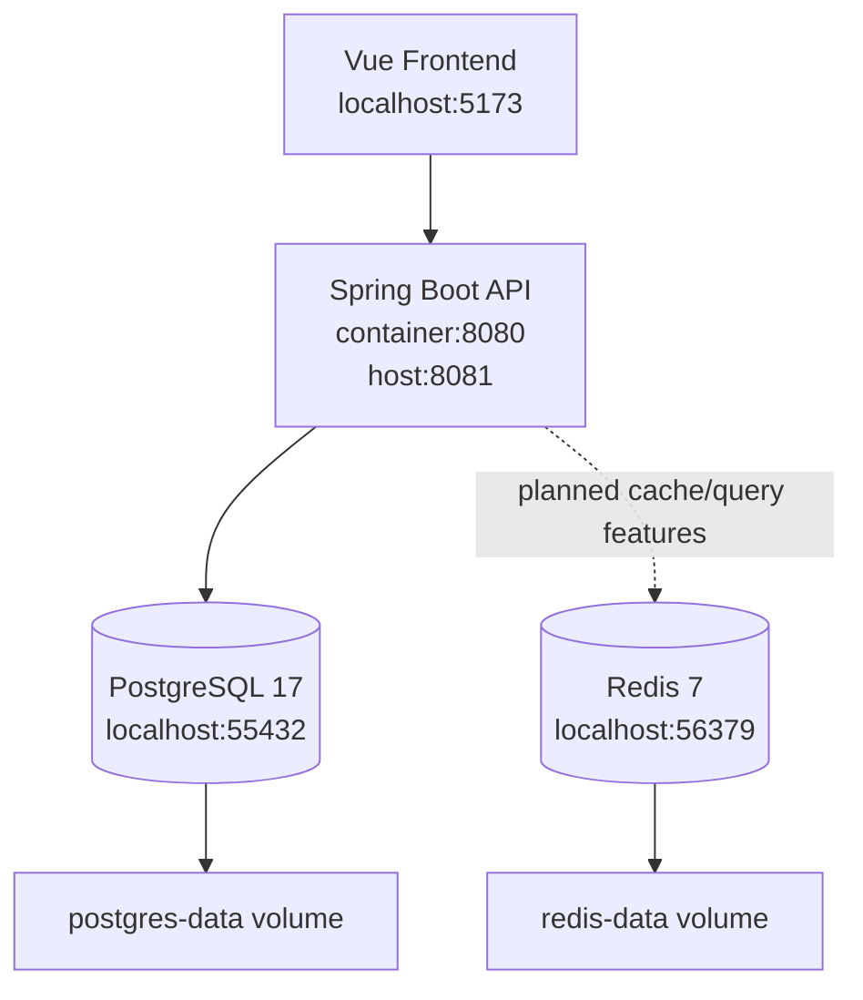
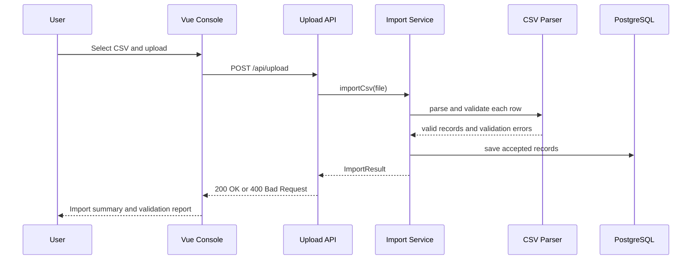

# Automotive Data Platform

A full-stack data ingestion platform for uploading, validating, and storing structured automotive data.

The project provides a clean foundation for vehicle, dealer, warranty, fleet, service, and customer data workflows. Files are accepted through a REST API, parsed row by row, validated, and persisted to PostgreSQL. A Vue frontend provides an operator-friendly upload console, while Docker Compose manages the local infrastructure.

## Table of Contents

- [Overview](#overview)
- [Aim](#aim)
- [What the Application Does](#what-the-application-does)
- [Expected Output](#expected-output)
- [Architecture](#architecture)
- [Tech Stack](#tech-stack)
- [Project Structure](#project-structure)
- [Getting Started](#getting-started)
- [API Reference](#api-reference)
- [Configuration](#configuration)
- [Testing](#testing)
- [Roadmap](#roadmap)

## Overview

Automotive Data Platform is a Spring Boot and Vue application designed around reliable data ingestion for automotive operations. It currently focuses on CSV upload, row-level validation, structured API responses, and durable storage in PostgreSQL.

The application is intentionally small, but built around production-friendly boundaries:

- the Vue frontend presents a clear ingestion console
- controllers handle HTTP concerns
- services orchestrate import workflows
- parser components validate incoming data
- repositories persist accepted records
- Docker Compose provides repeatable local infrastructure

## Aim

The aim of the project is to provide a clear, maintainable foundation for automotive data movement and validation.

At this stage, the platform is focused on one core workflow:

1. receive a CSV file
2. parse each data row
3. validate required fields and formats
4. store accepted rows
5. return a clear import summary and validation report

This makes the system useful as a base for broader automotive data integration features such as import history, transformation rules, cached summaries, dashboards, dealer feeds, vehicle record imports, and cloud deployment.

## What the Application Does

The current backend accepts CSV files with the following columns:

```csv
name,email,age
Dealer Contact,dealer.ops@example.com,42
Warranty Analyst,warranty@example.com,36
Fleet Coordinator,fleet@example.com,29
```

For each uploaded row, the application validates:

- `name` is present
- `email` is present and contains `@`
- `age` is present, numeric, and between `0` and `130`

Valid rows are saved to PostgreSQL. Invalid rows are rejected and returned to the caller with row numbers, field names, and readable error messages.

The frontend frames this workflow as an automotive ingestion console. The next backend iteration will move the import schema towards domain-specific fields such as VIN, registration, dealer code, warranty status, service date, and odometer reading.

## Expected Output

A successful upload returns `200 OK` with an import summary:

```json
{
  "rowsRead": 2,
  "rowsImported": 2,
  "rowsRejected": 0,
  "errors": []
}
```

An upload containing invalid rows returns `400 Bad Request` with row-level validation errors:

```json
{
  "rowsRead": 3,
  "rowsImported": 0,
  "rowsRejected": 3,
  "errors": [
    {
      "rowNumber": 2,
      "field": "name",
      "message": "Name is required"
    },
    {
      "rowNumber": 3,
      "field": "email",
      "message": "Email must contain @"
    },
    {
      "rowNumber": 4,
      "field": "age",
      "message": "Age must be a whole number"
    }
  ]
}
```

## Architecture

### Application Flow



### Local Infrastructure



### Import Sequence



## Tech Stack

| Area | Technology |
| --- | --- |
| Frontend | Vue 3, Vite |
| Styling | Tailwind CSS |
| Frontend package manager | Bun |
| Language | Java 17 |
| Framework | Spring Boot 3.5 |
| API | Spring Web |
| Persistence | Spring Data JPA, Hibernate |
| Database | PostgreSQL 17 |
| Cache / fast data access | Redis 7, provisioned locally |
| Build tool | Maven |
| Local infrastructure | Docker Compose |
| Testing | JUnit 5, Spring Boot Test, AssertJ, Mockito |

## Project Structure

```text
.
├── Dockerfile
├── .dockerignore
├── docker-compose.yml
├── frontend
│   ├── Dockerfile
│   ├── src
│   ├── package.json
│   └── vite.config.js
├── pom.xml
├── src
│   ├── main
│   │   ├── java/com/dataplatform
│   │   │   ├── controller
│   │   │   ├── dto
│   │   │   ├── model
│   │   │   ├── repository
│   │   │   └── service
│   │   └── resources/application.yaml
│   └── test/java/com/dataplatform
└── NOTES.md
```

## Getting Started

### Prerequisites

- Docker Desktop or Docker Engine

### Run the Full Platform

From a fresh clone, start everything with one command:

```bash
docker compose up --build
```

This builds and starts:

- Spring Boot backend
- Vue frontend
- PostgreSQL
- Redis

Check the services:

```bash
docker compose ps
```

The application is available at:

```text
http://localhost:5173
```

The backend API is available at:

```text
http://localhost:8081
```

PostgreSQL is available on:

```text
localhost:55432
```

Redis is available on:

```text
localhost:56379
```

### Local Development Alternative

If you want to run the backend directly from your terminal, start only the supporting services:

```bash
docker compose up -d postgres redis
```

Then run the backend:

```bash
./mvnw spring-boot:run
```

If port `8080` is already in use, run it on another port:

```bash
./mvnw spring-boot:run -Dspring-boot.run.arguments=--server.port=8081
```

The frontend can also run directly from the local terminal:

```bash
cd frontend
bun install
bun run dev
```

The frontend runs on:

```text
http://localhost:5173
```

The Vite dev server proxies `/api` and `/health` requests to the backend. In Docker Compose this target is `http://backend:8080`; in local development it defaults to `http://localhost:8081`.

### Health Check

```bash
/usr/bin/curl http://localhost:8081/health
```

Expected response:

```text
OK
```

## API Reference

### Health Check

```http
GET /health
```

Returns a simple `OK` response when the application is running.

### Upload CSV

```http
POST /api/upload
```

Form field:

| Field | Type | Description |
| --- | --- | --- |
| `file` | CSV file | File containing `name,email,age` columns |

Example:

```bash
printf "name,email,age\nDealer Contact,dealer.ops@example.com,42\nWarranty Analyst,warranty@example.com,36\n" > /tmp/records-valid.csv

/usr/bin/curl -sS -i \
  -F "file=@/tmp/records-valid.csv" \
  http://localhost:8081/api/upload
```

Invalid data example:

```bash
printf "name,email,age\n,missing-name@example.com,30\nNo Email,no-email,27\nBad Age,bad-age@example.com,not-a-number\n" > /tmp/records-invalid.csv

/usr/bin/curl -sS -i \
  -F "file=@/tmp/records-invalid.csv" \
  http://localhost:8081/api/upload
```

## Configuration

The application uses sensible local defaults and supports environment-variable overrides.

| Variable | Default | Purpose |
| --- | --- | --- |
| `SERVER_PORT` | `8080` | Spring Boot server port |
| `DATABASE_URL` | `jdbc:postgresql://localhost:55432/dataplatform` | PostgreSQL JDBC URL |
| `DATABASE_USERNAME` | `postgres` | Database username |
| `DATABASE_PASSWORD` | `postgres` | Database password |
| `REDIS_HOST` | `localhost` | Redis host |
| `REDIS_PORT` | `56379` | Redis port |
| `JPA_DDL_AUTO` | `update` | Hibernate schema handling |
| `JPA_SHOW_SQL` | `true` | SQL logging |
| `HIBERNATE_FORMAT_SQL` | `true` | Pretty SQL logging |

## Testing

Run the full test suite:

```bash
./mvnw test
```

The current tests cover:

- Spring application context startup
- successful CSV import
- invalid CSV validation output

Build the frontend:

```bash
cd frontend
bun run build
```

## Roadmap

Planned improvements:

- automotive import schema for vehicle, dealer, warranty, fleet, or service records
- Redis-backed import summary/query endpoint
- endpoint for listing imported automotive records
- import history tracking
- Dockerised application runtime
- GitHub Actions workflow
- Vue dashboard for uploads and validation results
- Azure deployment documentation
